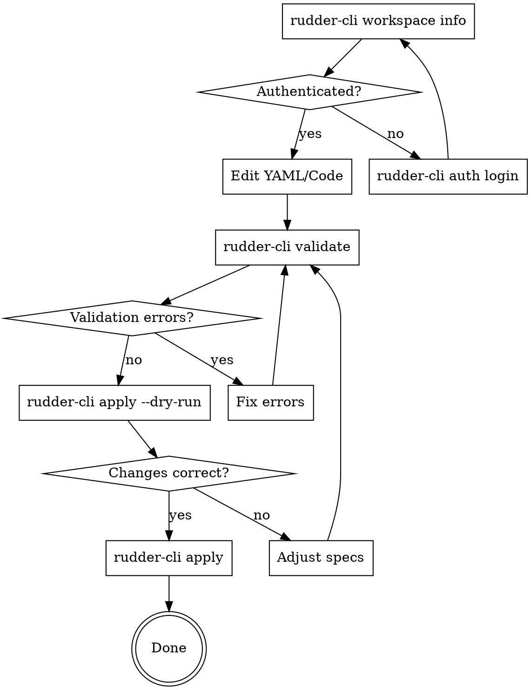

# Rudder CLI Development Workflow

## Overview

Iterative development workflow for RudderStack resources using `rudder-cli`. Follow the validate → dry-run → apply cycle to ensure correctness before making changes to workspaces.

## Prerequisites: Authentication

Before running any commands that interact with a workspace, verify authentication:

```bash
# Check if authenticated and show current workspace
rudder-cli workspace info
```

**If authenticated**, you'll see workspace details:
```
Workspace Information:
  ID:   2iKXWU4QnqclkpPIfXfsbBqrAVa
  Name: My Workspace
```

**If NOT authenticated**, you'll see an error. Authenticate first:
```bash
rudder-cli auth login
```

This will prompt for your RudderStack access token. Get one from:
Settings → Access Tokens in the RudderStack dashboard.

### Authentication Commands Reference

| Command | Purpose |
|---------|---------|
| `rudder-cli auth login` | Authenticate with access token |
| `rudder-cli workspace info` | Show current authenticated workspace |

**Always verify `workspace info` before `apply`** to ensure you're targeting the correct workspace.

## The Iteration Cycle



## Commands Reference

| Command | Purpose | When to Use |
|---------|---------|-------------|
| `rudder-cli validate -l ./` | Check YAML syntax and semantic rules | After any edit |
| `rudder-cli apply --dry-run -l ./` | Preview changes without applying | After validation passes |
| `rudder-cli apply -l ./` | Apply changes to workspace | After dry-run review |
| `rudder-cli plan -l ./` | Show detailed execution plan | Alternative to dry-run |

**Note:** `-l ./` specifies the project location (current directory).

## Step 1: Validate

```bash
rudder-cli validate -l ./
```

**Success output:**
```
✔ Project configuration is valid
```

**Error output format:**
```
error[<rule-id>]: <error message>
  --> <file>:<line>:<column>
      |
   10 | <problematic line>
      | ^^^^^^^^^^^^^^^^^^

Found N error(s), M warning(s)
```

### Common Validation Errors

| Error | Meaning | Fix |
|-------|---------|-----|
| `'import_name' must be camelCase of 'name'` | Library import_name doesn't match name | Convert name to camelCase |
| `spec-syntax-valid` | YAML schema violation | Check required fields |
| `code file not found` | File path in spec doesn't exist | Fix file path or create file |
| `mutually exclusive: code and file` | Both inline code and file specified | Use one or the other |

### Validation Error Resolution Pattern

1. Read the error message carefully - it includes file and line number
2. The rule ID (e.g., `transformations/transformation-library/spec-syntax-valid`) tells you what's being validated
3. Fix the specific issue mentioned
4. Re-run validate until it passes

## Step 2: Dry Run

```bash
rudder-cli apply --dry-run -l ./
```

**Output shows:**
- `New resources:` - Resources that will be created
- `Updated resources:` - Resources that will be modified (shows diff)
- `Deleted resources:` - Resources that will be removed

### Reading Dry Run Output

```
New resources:
  - transformation-library:base64-lib

Updated resources:
  - transformation:test-transformation
    - code: <old code> => <new code>
    - description: <old> => <new>
```

**Review checklist:**
- [ ] Are the correct resources being created?
- [ ] Are the correct resources being updated?
- [ ] Do the diffs show the expected changes?
- [ ] Are any resources being unexpectedly deleted?

## Step 3: Apply

```bash
rudder-cli apply -l ./
```

Only run after:
1. `validate` passes
2. `--dry-run` shows expected changes

## Workflow Examples

### Adding a New Library

```bash
# 1. Create YAML and code files
# 2. Validate
rudder-cli validate -l ./
# Fix any errors...

# 3. Preview
rudder-cli apply --dry-run -l ./
# Should show: New resources: - transformation-library:my-lib

# 4. Apply
rudder-cli apply -l ./
```

### Updating Existing Transformation

```bash
# 1. Edit the .js file and/or YAML
# 2. Validate
rudder-cli validate -l ./

# 3. Preview - verify only intended changes
rudder-cli apply --dry-run -l ./
# Should show: Updated resources: - transformation:my-transform
# Check the diff is what you expect

# 4. Apply
rudder-cli apply -l ./
```

### Debugging Validation Failures

```bash
# Run validate with verbose output
rudder-cli validate -l ./ --verbose

# Check specific file syntax
cat transformations/my-spec.yaml | yq .  # Validate YAML syntax

# Check JavaScript syntax
node --check transformations/javascript/my-code.js
```

## Error Categories

### Syntax Errors (validate catches)
- Invalid YAML structure
- Missing required fields
- Invalid field values
- File path issues

### Semantic Errors (validate catches)
- `import_name` not matching `name` in camelCase
- Invalid language values
- Code syntax errors

### Runtime Errors (apply catches)
- API authentication failures
- Permission issues
- Resource conflicts in workspace

## Tips

1. **Always validate first** - Catches most issues before API calls
2. **Always dry-run before apply** - Prevents unintended changes
3. **Check diffs carefully** - Ensure only expected changes appear
4. **Use version control** - Commit before apply, revert if needed

## Quick Iteration Loop

```bash
# Fast iteration cycle
while true; do
    rudder-cli validate -l ./ && \
    rudder-cli apply --dry-run -l ./ && \
    echo "Ready to apply. Press Enter or Ctrl+C" && \
    read && \
    rudder-cli apply -l ./
    break
done
```

## Troubleshooting

| Symptom | Check | Fix |
|---------|-------|-----|
| "unauthorized" or "401" error | Not authenticated | Run `rudder-cli auth login` |
| "workspace info" shows wrong workspace | Authenticated to wrong workspace | Run `rudder-cli auth login` with correct token |
| "Project configuration is valid" but dry-run shows nothing | No changes detected | Verify files are in correct location |
| Validation passes but dry-run fails | API/auth issue | Run `rudder-cli workspace info` to verify auth |
| Unexpected resource deletion | State mismatch | Check metadata.import section |
| Changes not appearing | Wrong project path | Verify `-l ./` points to right directory |
