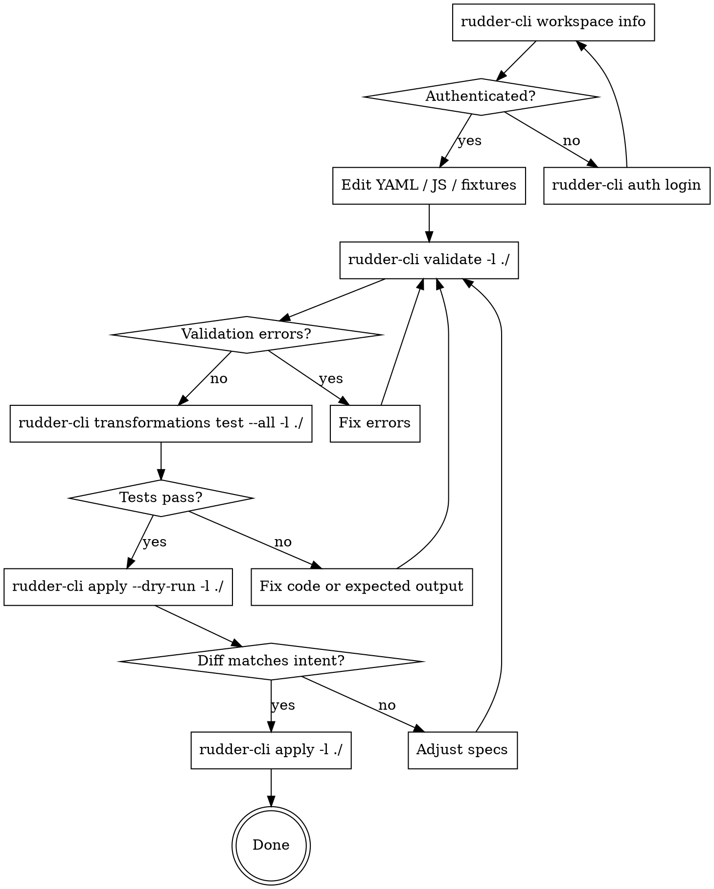

# RudderStack Transformations with Rudder CLI

## Overview

RudderStack transformations allow real-time event manipulation using JavaScript or Python. Libraries provide reusable code shared across transformations. Both are managed as code using YAML specs and the Rudder CLI.

## Recommended Workflow

Follow this loop for every change — authoring a new transformation or library, or editing existing code. Testing locally with fixtures is the key step that distinguishes transformations work from other CLI workflows.



**Steps:**
1. **Verify auth** — `rudder-cli workspace info`; re-auth with `rudder-cli auth login` if needed.
2. **Validate** — `rudder-cli validate -l ./` catches YAML schema errors, missing files, camelCase `import_name` violations.
3. **Test locally** — `rudder-cli transformations test --all -l ./` runs each transformation against its `tests/input/*.json` fixtures and diffs against `tests/output/*.json`. Use `--modified` for faster iteration or pass a specific transformation id.
4. **Dry run** — `rudder-cli apply --dry-run -l ./` shows the diff that would be applied. Check for unexpected deletions.
5. **Apply** — `rudder-cli apply -l ./` publishes libraries and transformations atomically (correct order handled by the CLI).

For the broader validate → apply cycle that applies to all CLI-managed resources, see the `rudder-cli-workflow` skill. This skill specializes it with the local-test step.

### Worked example

A complete end-to-end project — library, transformation, fixtures, and README — lives at `examples/transformations-workflow/` in this repo. It includes a ported Base64 library (`base64-lib`), a sample transformation that uses it, and input/output test fixtures. Use it as a scaffold for new transformations or as a reference for `tests/` structure.

## Directory Structure

```
transformations/
  my-transformation.yaml         # Transformation spec
  my-library.yaml                # Library spec
  javascript/
    my-transformation.js         # JavaScript code
    my-library.js               # Library code
  python/
    my-transformation.py         # Python code
    my-library.py               # Library code
  tests/
    input/
      event1.json               # Test input events
    output/
      event1.json               # Expected outputs
```

## YAML Schemas

### Transformation Spec

```yaml
version: "rudder/v1"
kind: "transformation"
metadata:
  name: "transformations"
  # Optional: import section for linking to existing workspace resources
  import:
    workspaces:
      - workspace_id: "your-workspace-id"
        resources:
          - remote_id: "existing-transformation-id"
            urn: "transformation:my-transformation"
spec:
  id: "my-transformation"           # Unique identifier (used as external ID)
  name: "My Transformation"         # Human-readable name
  description: "Description"        # Optional
  language: "javascript"            # "javascript" or "python"
  file: "javascript/my-transformation.js"  # Path to code (relative to YAML)
  # OR inline:
  # code: |
  #   export function transformEvent(event) { return event; }
  tests:                            # Optional - local testing only
    - name: "basic-test"
      input: "./tests/input"        # Directory with JSON events
      output: "./tests/output"      # Directory with expected results
```

**Note:** The `metadata.import` section is auto-generated when importing existing resources from a workspace. It links local files to remote resources.

### Library Spec

```yaml
version: "rudder/v1"
kind: "transformation-library"
metadata:
  name: "transformation-libraries"
spec:
  id: "my-library"                  # Unique identifier
  name: "My Library"                # Human-readable name
  description: "Reusable utilities" # Optional
  language: "javascript"            # "javascript" or "python"
  import_name: "myLibrary"          # MUST be camelCase of name field!
  file: "javascript/my-library.js"  # Path to code
```

**IMPORTANT:** `import_name` must be the exact camelCase conversion of `name`:
- "My Library" → "myLibrary"
- "Base64 Library" → "base64Library"
- "URL Parser Utils" → "urlParserUtils"

## Code Patterns

### Transformation Code (JavaScript)

```javascript
// transformEvent is the entry point - REQUIRED
// metadata is a FUNCTION that takes the event and returns metadata
export function transformEvent(event, metadata) {
    // Modify event
    event.context = event.context || {};
    event.context.transformed = true;

    // Access metadata - call as function with event
    const meta = metadata(event);
    event.metadata = meta;

    // Return event (or null/undefined to drop the event)
    return event;
}
```

**Key points:**
- `metadata` is a function, not an object - call it as `metadata(event)`
- Return `null` or `undefined` to drop/filter out an event
- The function must be exported with `export`

### Library Code (JavaScript)

```javascript
// Export functions for use in transformations
export function encode(str) {
    // Implementation
    return encodedStr;
}

export function decode(str) {
    // Implementation
    return decodedStr;
}
```

### Importing Libraries in Transformations

```javascript
// Import using the library's import_name (camelCase of name)
// If library name is "My Library", import_name is "myLibrary"
import { encode, decode } from "myLibrary";

export function transformEvent(event, metadata) {
    event.properties.encoded = encode(event.properties.data);
    return event;
}
```

**Remember:** The import string must exactly match the library's `import_name` field.

## CLI Commands

| Command | Description |
|---------|-------------|
| `rudder-cli validate` | Validate YAML specs and code |
| `rudder-cli plan` | Show planned changes |
| `rudder-cli apply` | Apply changes to workspace |
| `rudder-cli transformations test <id>` | Test single transformation |
| `rudder-cli transformations test --all` | Test all transformations |
| `rudder-cli transformations test --modified` | Test only modified |
| `rudder-cli import` | Import existing from workspace |
| `rudder-cli export` | Export to YAML files |

## Workflow: Adding a New Library

1. **Create library YAML spec:**
   ```yaml
   version: "rudder/v1"
   kind: "transformation-library"
   metadata:
     name: "transformation-libraries"
   spec:
     id: "base64-lib"
     name: "Base64 Library"
     description: "Base64 encoding/decoding"
     language: "javascript"
     import_name: "base64Library"  # camelCase of "Base64 Library"
     file: "javascript/base64-lib.js"
   ```

2. **Create library code file** at `javascript/base64-lib.js`

3. **Validate:** `rudder-cli validate -l ./`

4. **Dry-run:** `rudder-cli apply --dry-run -l ./`

5. **Apply:** `rudder-cli apply -l ./`

**See `rudder-cli-workflow` skill for detailed iteration workflow.**

## Workflow: Using Library in Transformation

1. **Import the library** using its `import_name`:
   ```javascript
   import { encode } from "base64Library";
   ```

2. **Dependencies auto-detected:** The CLI parses imports and creates dependency graph

3. **Batch publish:** Libraries and transformations publish atomically

## Porting External Libraries

When porting npm/external libraries to RudderStack:

1. **Remove UMD/CommonJS wrappers** - Use ES modules only
2. **Remove Node.js-specific code** - No `Buffer`, `require()`, etc.
3. **Export functions directly** - Not as object methods
4. **Keep dependencies minimal** - RudderStack sandbox is limited
5. **Use polyfills for browser APIs** - `btoa`/`atob` may need polyfills
6. **Convert internal object methods to standalone functions**

### Example: Porting a Library

**Original (UMD with Buffer):**
```javascript
(function(global, factory) {
    typeof exports === 'object' ? module.exports = factory() : ...
})(this, function() {
    var _hasBuffer = typeof Buffer === 'function';
    var encode = _hasBuffer
        ? (s) => Buffer.from(s).toString('base64')
        : (s) => btoa(s);
    return { encode: encode };
});
```

**Ported (ES Module with polyfill):**
```javascript
// Polyfill for environments without btoa
const btoaPolyfill = (bin) => {
    const b64chs = 'ABCDEFGHIJKLMNOPQRSTUVWXYZabcdefghijklmnopqrstuvwxyz0123456789+/=';
    let asc = '';
    // ... pure JS implementation
    return asc;
};

const _btoa = typeof btoa === 'function' ? (s) => btoa(s) : btoaPolyfill;

// Export as standalone function
export function encode(s) {
    return _btoa(s);
}
```

### Porting Checklist

- [ ] Remove IIFE/UMD wrapper
- [ ] Remove `module.exports`, `exports`, `define()` calls
- [ ] Replace `require()` with `import`
- [ ] Replace `Buffer` usage with pure JS (Uint8Array, manual encoding)
- [ ] Add polyfills for `btoa`/`atob` if used
- [ ] Convert class methods to exported functions if needed
- [ ] Test with various input types (UTF-8, special chars, edge cases)

## Common Mistakes

| Mistake | Fix |
|---------|-----|
| Missing `import_name` in library | Add unique `import_name` to library spec |
| `import_name` not matching `name` | **MUST be camelCase of `name`** (e.g., "Base64 Library" → "base64Library") |
| Using `require()` in code | Use ES `import` syntax |
| Using Node.js `Buffer` | Use pure JavaScript implementations |
| Relative imports like `./mylib` | Use library's `import_name` |
| Forgetting to export functions | Add `export` keyword |
| Inline code AND file both set | Use one or the other, not both |

**Critical:** The `import_name` field is validated to be the exact camelCase conversion of the `name` field. This is enforced by `rudder-cli validate`.

## RudderStack Built-in Libraries

Access built-in libraries with `@rs/` prefix:

```javascript
import { get } from "@rs/lodash/v1";
import { v4 as uuidv4 } from "@rs/uuid/v1";
```

## Testing

Test files use JSON format:

**Input (`tests/input/event1.json`):**
```json
{
  "type": "track",
  "event": "Test Event",
  "properties": {
    "data": "hello"
  }
}
```

**Expected Output (`tests/output/event1.json`):**
```json
{
  "type": "track",
  "event": "Test Event",
  "properties": {
    "data": "hello",
    "encoded": "aGVsbG8="
  }
}
```

## Quick Reference

| Element | Location | Required Fields |
|---------|----------|-----------------|
| Transformation spec | `transformations/*.yaml` | id, name, language, file/code |
| Library spec | `transformations/*.yaml` | id, name, language, import_name, file/code |
| JS code | `transformations/javascript/*.js` | `export function transformEvent` |
| Python code | `transformations/python/*.py` | `def transform_event` |
| Test input | `tests/input/*.json` | Valid event JSON |
| Test output | `tests/output/*.json` | Expected result JSON |

## Publish Order

The CLI handles publish order automatically:
1. Workspace credentials (secrets)
2. Libraries (dependencies)
3. Transformations (depend on libraries)

All published atomically - no partial updates.

## Credential Security

- **Never hardcode API keys in transformation code** - use workspace credentials/secrets instead
- **Store workspace tokens in environment variables** - never commit `RUDDER_ACCESS_TOKEN` to git
- **Add `.env` to `.gitignore`** - if using dotenv files for local development
- **Use CI/CD secrets** - for automated deployments, use repository secrets
- **Reference secrets via workspace credentials** - transformation code can access configured secrets securely

## Handling External Content

When processing events in transformations:

- **Validate event structure** - check for expected fields before processing
- **Sanitize string inputs** - escape or validate user-generated content in event properties
- **Don't eval dynamic content** - never use `eval()` or `Function()` on event data
- **Extract only expected fields** - access known properties, don't iterate over unknown keys
- **Log safely** - avoid logging full event payloads that may contain PII
