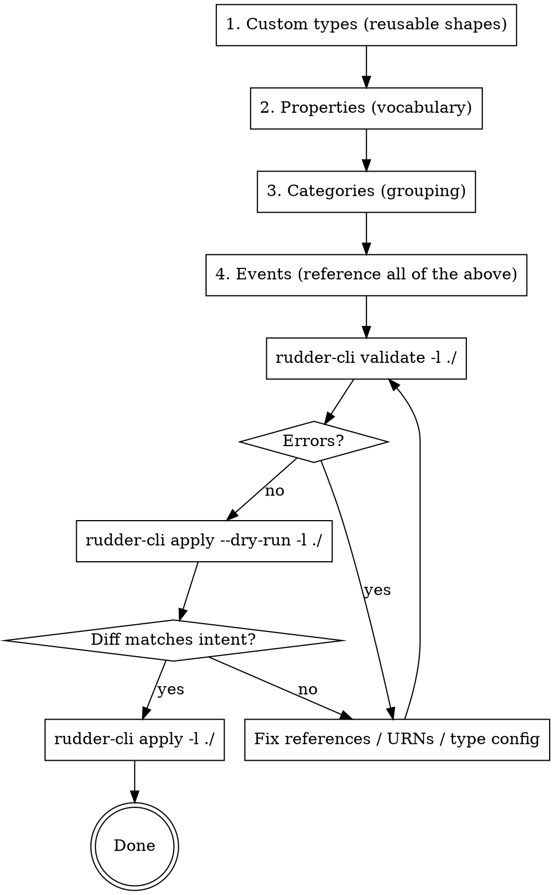

# RudderStack Data Catalog Management

This skill teaches how to create and manage the building blocks of instrumentation: **events**, **properties**, **categories**, and **custom types**.

## Recommended Workflow

When adding or editing catalog resources, author bottom-up (dependencies first) then validate and apply. The referencing order is strict — an event can't reference a property URN until that property exists.



**Why bottom-up:** properties reference custom types; events reference properties, categories, and custom types. Creating in the reverse order means every intermediate `validate` fails on missing references. For the validate → dry-run → apply details (error formats, diff reading, auth prereqs), see the `rudder-cli-workflow` skill.

## Core Concepts

| Concept | Purpose | Example |
|---------|---------|---------|
| **Events** | What happened | "Product Viewed", "Order Completed" |
| **Properties** | Attributes of events | product_id, price, quantity |
| **Categories** | Organize events | "Ecommerce", "User Lifecycle" |
| **Custom Types** | Reusable validation patterns | ProductType, AddressType, Currency |

## Directory Structure

```
data-catalog/
├── events/
│   ├── ecommerce.yaml        # Product Viewed, Order Completed, etc.
│   └── user-lifecycle.yaml   # Signed Up, Logged In, etc.
├── properties/
│   ├── product-properties.yaml
│   ├── customer-properties.yaml
│   └── address-properties.yaml
├── categories/
│   └── categories.yaml
└── custom-types/
    ├── product-type.yaml
    └── address-type.yaml
```

## YAML Schemas

### Event Definition

```yaml
version: "rudder/v1"
kind: "event"
metadata:
  name: "events"
spec:
  name: "Product Viewed"
  description: "User viewed a product detail page"
  category: "urn:rudder:category/ecommerce"
  rules:
    - property: "urn:rudder:property/product_id"
      required: true
    - property: "urn:rudder:property/product_name"
      required: true
    - property: "urn:rudder:property/product_price"
      required: true
    - property: "urn:rudder:property/product_category"
    - property: "urn:rudder:property/page_url"
```

### Property Definition

```yaml
version: "rudder/v1"
kind: "property"
metadata:
  name: "properties"
spec:
  name: "product_id"
  type: "string"
  description: "Unique product identifier"
  config:
    minLength: 3
    maxLength: 50
```

### Category Definition

```yaml
version: "rudder/v1"
kind: "category"
metadata:
  name: "categories"
spec:
  name: "ecommerce"
  description: "Events related to product discovery, cart, and purchase"
```

### Custom Type Definition

```yaml
version: "rudder/v1"
kind: "custom-type"
metadata:
  name: "custom-types"
spec:
  name: "ProductType"
  type: "object"
  description: "Consolidated product information"
  config:
    properties:
      - property: "urn:rudder:property/product_id"
        required: true
      - property: "urn:rudder:property/product_sku"
        required: true
      - property: "urn:rudder:property/product_name"
        required: true
      - property: "urn:rudder:property/product_category"
        required: true
      - property: "urn:rudder:property/product_price"
        required: true
      - property: "urn:rudder:property/product_msrp"
        required: false
```

## URN Reference System

Resources reference each other using URNs (Uniform Resource Names):

| Resource Type | URN Pattern | Example |
|---------------|-------------|---------|
| Event | `urn:rudder:event/<name>` | `urn:rudder:event/product-viewed` |
| Property | `urn:rudder:property/<name>` | `urn:rudder:property/product_id` |
| Category | `urn:rudder:category/<name>` | `urn:rudder:category/ecommerce` |
| Custom Type | `urn:rudder:custom-type/<name>` | `urn:rudder:custom-type/product-type` |

**Important:** URN names are kebab-case versions of the resource name.

## Property Type Configuration

### String Type

```yaml
spec:
  name: "customer_email"
  type: "string"
  config:
    minLength: 5
    maxLength: 255
    pattern: "^[a-zA-Z0-9._%+-]+@[a-zA-Z0-9.-]+\\.[a-zA-Z]{2,}$"
```

| Config Option | Description |
|---------------|-------------|
| `minLength` | Minimum string length |
| `maxLength` | Maximum string length |
| `pattern` | Regex pattern for validation |
| `format` | Built-in format (date-time, email, uri) |
| `enum` | Array of allowed values |

### Number Type

```yaml
spec:
  name: "product_price"
  type: "number"
  description: "Product price in USD"
  config:
    minimum: 0
    exclusiveMinimum: true
```

| Config Option | Description |
|---------------|-------------|
| `minimum` | Minimum value (inclusive) |
| `maximum` | Maximum value (inclusive) |
| `exclusiveMinimum` | Minimum is exclusive |
| `exclusiveMaximum` | Maximum is exclusive |

### Integer Type

```yaml
spec:
  name: "quantity"
  type: "integer"
  description: "Product quantity in cart"
  config:
    minimum: 1
    maximum: 100
```

### Array Type

```yaml
spec:
  name: "products"
  type: "array"
  description: "List of products in order"
  config:
    items:
      customType: "urn:rudder:custom-type/product-type"
    minItems: 1
```

| Config Option | Description |
|---------------|-------------|
| `items.type` | Type of array items (string, number, etc.) |
| `items.customType` | Custom type for array items |
| `minItems` | Minimum array length |
| `maxItems` | Maximum array length |

### Enum (Fixed Values)

```yaml
spec:
  name: "product_category"
  type: "string"
  description: "Product category"
  config:
    enum:
      - "Footwear"
      - "Clothing"
      - "Accessories"
```

## Real-World Example: E-Commerce Data Catalog

### Custom Types

**ProductType** - Reusable across Product Viewed, Product Added to Cart:

```yaml
# custom-types/product-type.yaml
version: "rudder/v1"
kind: "custom-type"
metadata:
  name: "custom-types"
spec:
  name: "ProductType"
  type: "object"
  description: "Consolidated product information for e-commerce events"
  config:
    properties:
      - property: "urn:rudder:property/product_id"
        required: true
      - property: "urn:rudder:property/product_sku"
        required: true
      - property: "urn:rudder:property/product_name"
        required: true
      - property: "urn:rudder:property/product_category"
        required: true
      - property: "urn:rudder:property/product_price"
        required: true
      - property: "urn:rudder:property/product_msrp"
        required: false
```

**AddressType** - Reusable for shipping AND billing:

```yaml
# custom-types/address-type.yaml
version: "rudder/v1"
kind: "custom-type"
metadata:
  name: "custom-types"
spec:
  name: "AddressType"
  type: "object"
  description: "US mailing address"
  config:
    properties:
      - property: "urn:rudder:property/address"
        required: true
      - property: "urn:rudder:property/city"
        required: true
      - property: "urn:rudder:property/state"
        required: true
      - property: "urn:rudder:property/zipcode"
        required: true
```

### Properties

```yaml
# properties/product-properties.yaml
version: "rudder/v1"
kind: "property"
metadata:
  name: "properties"
spec:
  name: "product_id"
  type: "string"
  description: "Unique product identifier"
  config:
    minLength: 3
    maxLength: 50
---
version: "rudder/v1"
kind: "property"
metadata:
  name: "properties"
spec:
  name: "product_sku"
  type: "string"
  description: "Product SKU code"
  config:
    minLength: 2
    maxLength: 20
---
version: "rudder/v1"
kind: "property"
metadata:
  name: "properties"
spec:
  name: "product_name"
  type: "string"
  description: "Product display name"
  config:
    minLength: 2
    maxLength: 255
---
version: "rudder/v1"
kind: "property"
metadata:
  name: "properties"
spec:
  name: "product_category"
  type: "string"
  description: "Product category"
  config:
    enum:
      - "Footwear"
      - "Clothing"
      - "Accessories"
---
version: "rudder/v1"
kind: "property"
metadata:
  name: "properties"
spec:
  name: "product_price"
  type: "number"
  description: "Current product price in USD"
  config:
    minimum: 0
    exclusiveMinimum: true
```

```yaml
# properties/address-properties.yaml
version: "rudder/v1"
kind: "property"
metadata:
  name: "properties"
spec:
  name: "zipcode"
  type: "string"
  description: "US ZIP code (5 or 9 digit)"
  config:
    pattern: "^[0-9]{5}(-[0-9]{4})?$"
```

### Events

```yaml
# events/ecommerce.yaml
version: "rudder/v1"
kind: "event"
metadata:
  name: "events"
spec:
  name: "Product Viewed"
  description: "User viewed a product detail page"
  category: "urn:rudder:category/ecommerce"
  rules:
    - property: "urn:rudder:property/product"
      required: true
      customType: "urn:rudder:custom-type/product-type"
    - property: "urn:rudder:property/page_url"
    - property: "urn:rudder:property/referrer_url"
---
version: "rudder/v1"
kind: "event"
metadata:
  name: "events"
spec:
  name: "Product Added to Cart"
  description: "User added a product to their cart"
  category: "urn:rudder:category/ecommerce"
  rules:
    - property: "urn:rudder:property/product"
      required: true
      customType: "urn:rudder:custom-type/product-type"
    - property: "urn:rudder:property/quantity"
      required: true
    - property: "urn:rudder:property/cart_total"
    - property: "urn:rudder:property/product_count"
---
version: "rudder/v1"
kind: "event"
metadata:
  name: "events"
spec:
  name: "Order Completed"
  description: "Customer completed a purchase"
  category: "urn:rudder:category/ecommerce"
  rules:
    - property: "urn:rudder:property/order_id"
      required: true
    - property: "urn:rudder:property/order_total"
      required: true
    - property: "urn:rudder:property/customer_email"
      required: true
    - property: "urn:rudder:property/shipping_address"
      required: true
      customType: "urn:rudder:custom-type/address-type"
    - property: "urn:rudder:property/billing_address"
      required: true
      customType: "urn:rudder:custom-type/address-type"
    - property: "urn:rudder:property/products"
      required: true
```

## Why Custom Types Matter

**Without custom types** - 14 individual properties repeated across events:
```
Product Viewed: product_id, product_sku, product_name, product_category, product_price, product_msrp
Product Added to Cart: product_id, product_sku, product_name, product_category, product_price, product_msrp
Order Completed: shipping_address, shipping_city, shipping_state, shipping_zipcode, billing_address, billing_city, billing_state, billing_zipcode
```

**With custom types** - 2 reusable types:
```
ProductType → used by Product Viewed, Product Added to Cart
AddressType → used by shipping_address AND billing_address in Order Completed
```

Benefits:
- Single source of truth for validation rules
- Change validation in one place, applies everywhere
- Cleaner event definitions
- Better data quality through enforced structure

## Validation Commands

```bash
# Validate all resources
rudder-cli validate -l ./

# Validate specific directory
rudder-cli validate -l ./data-catalog/events/

# Preview changes before applying
rudder-cli apply --dry-run -l ./

# Apply to workspace
rudder-cli apply -l ./
```

## Common Patterns

### Pattern: Monetary Values
Use number type with separate currency property:

```yaml
# Price property
spec:
  name: "order_total"
  type: "number"
  config:
    minimum: 0

# Currency property
spec:
  name: "currency"
  type: "string"
  config:
    pattern: "^[A-Z]{3}$"  # ISO 4217
    enum: ["USD", "EUR", "GBP"]
```

### Pattern: Timestamps
Use string with date-time format:

```yaml
spec:
  name: "created_at"
  type: "string"
  config:
    format: "date-time"  # ISO 8601
```

### Pattern: Optional with Default Context
Include context properties for attribution:

```yaml
# Always include for funnel analysis
- property: "urn:rudder:property/page_url"
- property: "urn:rudder:property/referrer_url"
- property: "urn:rudder:property/session_id"
```

## Common Mistakes

| Mistake | Problem | Fix |
|---------|---------|-----|
| Missing property definition | URN reference fails | Create property YAML first |
| Wrong URN format | Reference not found | Use kebab-case: `product-id` not `product_id` |
| Type mismatch | Validation fails | Match property type to expected data |
| Circular custom type | Infinite loop | Custom types cannot reference themselves |
| Wrong config for type | Config ignored | Use `minLength` for strings, `minimum` for numbers |
