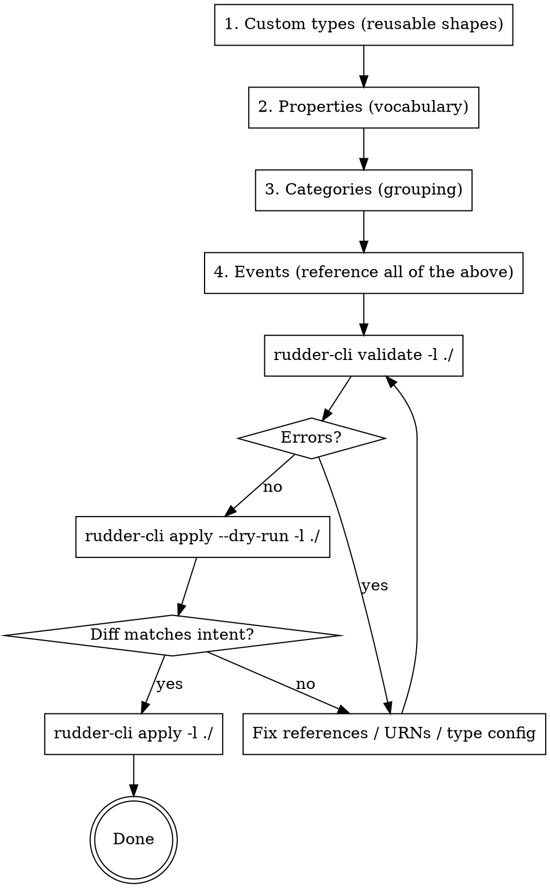

# RudderStack Data Catalog Management

This skill teaches how to create and manage the building blocks of instrumentation: **events**, **properties**, **categories**, and **custom types**.

## Recommended Workflow

When adding or editing catalog resources, author bottom-up (dependencies first) then validate and apply. The referencing order is strict — an event can't reference a property URN until that property exists.



**Why bottom-up:** properties reference custom types; events reference properties, categories, and custom types. Creating in the reverse order means every intermediate `validate` fails on missing references. For the validate → dry-run → apply details (error formats, diff reading, auth prereqs), see the `rudder-cli-workflow` skill.

## Core Concepts

| Concept | Purpose | Example |
|---------|---------|---------|
| **Events** | What happened | "Product Viewed", "Order Completed" |
| **Properties** | Attributes of events | product_id, price, quantity |
| **Categories** | Organize events | "Ecommerce", "User Lifecycle" |
| **Custom Types** | Reusable validation patterns | ProductType, AddressType, Currency |

## Before Creating: Check Existing Catalog

Before creating new events or properties, check what already exists to prevent duplicates and ensure consistency.

### Why Check First?

- **Prevents duplicate events** with different names ("Product Viewed" vs "ProductView")
- **Ensures warehouse consistency** — same data, same column names
- **Reuses existing custom types** — don't reinvent AddressType
- **Maintains naming conventions** — follow established patterns

### How to Check

**Using Rudder CLI:**
```bash
# List existing events
rudder-cli get events

# List existing properties
rudder-cli get properties

# List custom types
rudder-cli get custom-types
```

**Using MCP:**
```
Tool: list_data_catalog_events
Search for events matching your proposed name

Tool: list_data_catalog_properties
Check if property already exists
```

### Naming Convention Validation

Before proposing new resources, verify they follow conventions:

| Resource | Convention | Example | Anti-Example |
|----------|------------|---------|--------------|
| Events | Title Case with spaces | `Product Viewed` | `productViewed`, `product_viewed` |
| Properties | snake_case | `product_id` | `productId`, `ProductId` |
| Categories | kebab-case | `user-lifecycle` | `userLifecycle`, `user_lifecycle` |
| Custom Types | PascalCase | `ProductType` | `product_type`, `productType` |

### Check for Similar Events

If proposing "Transformation Created", search for:
- Existing "Transformation Created"
- Similar: "Transformation Added", "Create Transformation"
- Related: other transformation events

```bash
rudder-cli get events | grep -i transform
```

## Directory Structure

```
data-catalog/
├── events/
│   ├── ecommerce.yaml        # Product Viewed, Order Completed, etc.
│   └── user-lifecycle.yaml   # Signed Up, Logged In, etc.
├── properties/
│   ├── product-properties.yaml
│   ├── customer-properties.yaml
│   └── address-properties.yaml
├── categories/
│   └── categories.yaml
└── custom-types/
    ├── product-type.yaml
    └── address-type.yaml
```

## YAML Schemas

### Event Definition

```yaml
version: "rudder/v1"
kind: "event"
metadata:
  name: "events"
spec:
  name: "Product Viewed"
  description: "User viewed a product detail page"
  category: "urn:rudder:category/ecommerce"
  rules:
    - property: "urn:rudder:property/product_id"
      required: true
    - property: "urn:rudder:property/product_name"
      required: true
    - property: "urn:rudder:property/product_price"
      required: true
    - property: "urn:rudder:property/product_category"
    - property: "urn:rudder:property/page_url"
```

### Property Definition

```yaml
version: "rudder/v1"
kind: "property"
metadata:
  name: "properties"
spec:
  name: "product_id"
  type: "string"
  description: "Unique product identifier"
  config:
    minLength: 3
    maxLength: 50
```

### Category Definition

```yaml
version: "rudder/v1"
kind: "category"
metadata:
  name: "categories"
spec:
  name: "ecommerce"
  description: "Events related to product discovery, cart, and purchase"
```

### Custom Type Definition

```yaml
version: "rudder/v1"
kind: "custom-type"
metadata:
  name: "custom-types"
spec:
  name: "ProductType"
  type: "object"
  description: "Consolidated product information"
  config:
    properties:
      - property: "urn:rudder:property/product_id"
        required: true
      - property: "urn:rudder:property/product_sku"
        required: true
      - property: "urn:rudder:property/product_name"
        required: true
      - property: "urn:rudder:property/product_category"
        required: true
      - property: "urn:rudder:property/product_price"
        required: true
      - property: "urn:rudder:property/product_msrp"
        required: false
```

## URN Reference System

Resources reference each other using URNs (Uniform Resource Names):

| Resource Type | URN Pattern | Example |
|---------------|-------------|---------|
| Event | `urn:rudder:event/<name>` | `urn:rudder:event/product-viewed` |
| Property | `urn:rudder:property/<name>` | `urn:rudder:property/product_id` |
| Category | `urn:rudder:category/<name>` | `urn:rudder:category/ecommerce` |
| Custom Type | `urn:rudder:custom-type/<name>` | `urn:rudder:custom-type/product-type` |

**Important:** URN names are kebab-case versions of the resource name.

## Property Type Configuration

### String Type

```yaml
spec:
  name: "customer_email"
  type: "string"
  config:
    minLength: 5
    maxLength: 255
    pattern: "^[a-zA-Z0-9._%+-]+@[a-zA-Z0-9.-]+\\.[a-zA-Z]{2,}$"
```

| Config Option | Description |
|---------------|-------------|
| `minLength` | Minimum string length |
| `maxLength` | Maximum string length |
| `pattern` | Regex pattern for validation |
| `format` | Built-in format (date-time, email, uri) |
| `enum` | Array of allowed values |

### Number Type

```yaml
spec:
  name: "product_price"
  type: "number"
  description: "Product price in USD"
  config:
    minimum: 0
    exclusiveMinimum: true
```

| Config Option | Description |
|---------------|-------------|
| `minimum` | Minimum value (inclusive) |
| `maximum` | Maximum value (inclusive) |
| `exclusiveMinimum` | Minimum is exclusive |
| `exclusiveMaximum` | Maximum is exclusive |

### Integer Type

```yaml
spec:
  name: "quantity"
  type: "integer"
  description: "Product quantity in cart"
  config:
    minimum: 1
    maximum: 100
```

### Array Type

```yaml
spec:
  name: "products"
  type: "array"
  description: "List of products in order"
  config:
    items:
      customType: "urn:rudder:custom-type/product-type"
    minItems: 1
```

| Config Option | Description |
|---------------|-------------|
| `items.type` | Type of array items (string, number, etc.) |
| `items.customType` | Custom type for array items |
| `minItems` | Minimum array length |
| `maxItems` | Maximum array length |

### Enum (Fixed Values)

```yaml
spec:
  name: "product_category"
  type: "string"
  description: "Product category"
  config:
    enum:
      - "Footwear"
      - "Clothing"
      - "Accessories"
```

## Real-World Example

See `references/ecommerce-example.md` for a complete e-commerce data catalog with custom types (ProductType, AddressType), properties, and events showing how these components work together.

## Why Custom Types Matter

Custom types let you define reusable validation patterns:
- **ProductType** → used by Product Viewed, Product Added to Cart
- **AddressType** → used by shipping_address AND billing_address

Benefits: single source of truth, change in one place, cleaner event definitions.

## Creating Properties from Code Types

When your codebase already has domain types, derive properties from them to ensure alignment.

### Enum to Property

```typescript
// Code
enum BillingPlan {
  FREE = 'free',
  STARTER = 'starter',
  GROWTH = 'growth',
  ENTERPRISE = 'enterprise',
}
```

```yaml
# Property - values must match exactly
spec:
  name: "billing_plan"
  type: "string"
  config:
    enum:
      - "free"        # Matches BillingPlan.FREE
      - "starter"
      - "growth"
      - "enterprise"
```

### String Union to Property

```typescript
// Code
type TransformationLanguage = 'javascript' | 'python';
```

```yaml
# Property
spec:
  name: "transformation_language"
  type: "string"
  config:
    enum:
      - "javascript"
      - "python"
```

### Critical: Use Exact Values

The tracking plan **must** use the exact string values from code:

```typescript
// If code uses lowercase
enum Region {
  US = 'us',    // lowercase
  EU = 'eu',
}
```

```yaml
# YAML must match exactly
config:
  enum:
    - "us"      # NOT "US" or "Us"
    - "eu"      # NOT "EU" or "Eu"
```

For the full code-first workflow, see `rudder-code-first-instrumentation` skill.

## Validation Commands

```bash
# Validate all resources
rudder-cli validate -l ./

# Validate specific directory
rudder-cli validate -l ./data-catalog/events/

# Preview changes before applying
rudder-cli apply --dry-run -l ./

# Apply to workspace
rudder-cli apply -l ./
```

## Common Patterns

### Pattern: Monetary Values
Use number type with separate currency property:

```yaml
# Price property
spec:
  name: "order_total"
  type: "number"
  config:
    minimum: 0

# Currency property
spec:
  name: "currency"
  type: "string"
  config:
    pattern: "^[A-Z]{3}$"  # ISO 4217
    enum: ["USD", "EUR", "GBP"]
```

### Pattern: Timestamps
Use string with date-time format:

```yaml
spec:
  name: "created_at"
  type: "string"
  config:
    format: "date-time"  # ISO 8601
```

### Pattern: Optional with Default Context
Include context properties for attribution:

```yaml
# Always include for funnel analysis
- property: "urn:rudder:property/page_url"
- property: "urn:rudder:property/referrer_url"
- property: "urn:rudder:property/session_id"
```

## Common Mistakes

| Mistake | Problem | Fix |
|---------|---------|-----|
| Missing property definition | URN reference fails | Create property YAML first |
| Wrong URN format | Reference not found | Use kebab-case: `product-id` not `product_id` |
| Type mismatch | Validation fails | Match property type to expected data |
| Circular custom type | Infinite loop | Custom types cannot reference themselves |
| Wrong config for type | Config ignored | Use `minLength` for strings, `minimum` for numbers |
